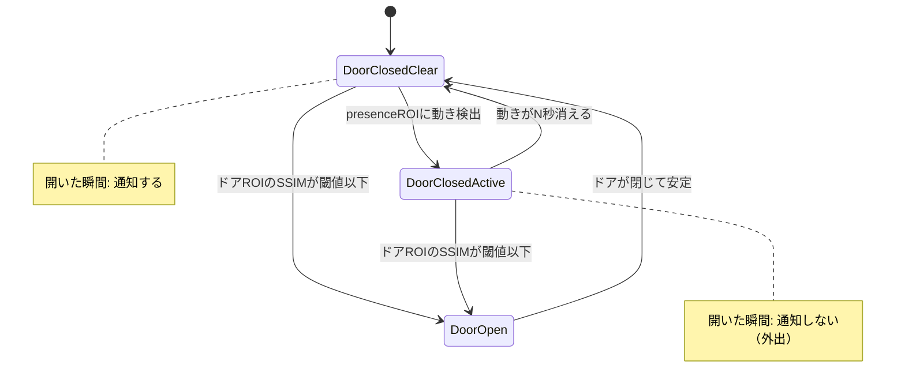
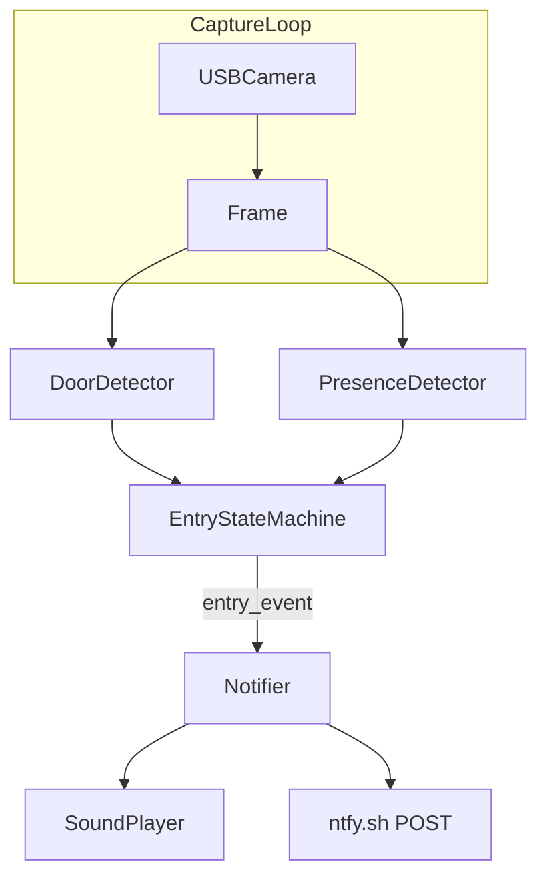

# ドア入室検知（インターホン替わり）実装プラン

## 要件の整理

| 項目 | 方針 |
|------|------|
| 環境 | Windows サーバー PC + USB カメラ、常時起動 |
| 録画 | なし（フレームはメモリ上のみ、即破棄） |
| 通知 | ローカル音声 + [ntfy.sh](https://ntfy.sh)（トピック名を設定ファイルで指定） |
| 検知対象 | **外からの入室のみ** |
| 抑制条件 | ドアが開く直前にドア付近 ROI で動きがあった → **室内から外出** とみなし通知しない |

## 判定ロジック（核心）



**入室と判定する条件（すべて満たす）:**
1. ドアが「閉」→「開」に遷移した（SSIM が閾値以下が `door_open_min_frames` フレーム続く）
2. 遷移開始時点で、直近 `motion_lookback_seconds` 秒間、**presence ROI 内に有意な動きがなかった**
3. 前回通知から `alert_cooldown_seconds` 以上経過（連続通知防止）

**外出とみなして抑制:**
- ドアが開く直前（lookback 期間内）に presence ROI で動きがあった → 室内の人がドアへ向かったと判断

## アーキテクチャ



## プロジェクト構成（新規）

```
RoomEntryDetection/
  requirements.txt
  config.yaml              # カメラ・ROI・閾値・ntfy トピック
  config.example.yaml
  README.md
  assets/
    alert.wav              # 通知音（なければ winsound.Beep にフォールバック）
  src/
    __init__.py
    main.py                # エントリポイント、メインループ
    config.py              # YAML 読み込み・バリデーション
    camera.py              # VideoCapture ラッパ（再接続）
    door_detector.py       # ドア ROI の SSIM / 基準画像更新
    presence_detector.py   # presence ROI の MOG2 動き検出
    state_machine.py       # 入室/外出判定・クールダウン
    notifier.py            # 音声 + ntfy HTTP POST
  tools/
    setup_roi.py           # 初回 ROI 設定用（マウスで矩形指定 → config 保存）
```

## 各モジュールの責務

### [`src/door_detector.py`](src/door_detector.py)
- ドア ROI を切り出し、基準画像（閉じた状態）と SSIM を比較
- SSIM は `scikit-image` の `structural_similarity` を使用（照明変化に差分より強い）
- ドアが `door_closed_stable_seconds` 以上変化なし → 基準画像を自動更新
- 返り値: `is_open: bool`, `ssim_score: float`

### [`src/presence_detector.py`](src/presence_detector.py)
- **ドアが閉じている間のみ** presence ROI に MOG2 を適用
- 前景ピクセル比率が閾値超 → `motion_detected`
- 直近 `motion_lookback_seconds` 秒の動き有無をリングバッファで保持
- 返り値: `has_recent_motion: bool`（lookback 内に一度でも動きがあれば True）

### [`src/state_machine.py`](src/state_machine.py)
- ドア「閉→開」エッジ検出時に `has_recent_motion` をスナップショット
- `not has_recent_motion` → `EntryEvent` を発行
- `has_recent_motion` → ログのみ（外出抑制）
- クールダウン管理

### [`src/notifier.py`](src/notifier.py)
- **音声:** `assets/alert.wav` を `winsound.PlaySound`（非同期 `SND_ASYNC`）で再生。ファイル無し時は `winsound.Beep`
- **ntfy:** `POST https://ntfy.sh/{topic}` with body `"ドアが開きました（外からの入室）"`, Title ヘッダ付き
- ntfy 失敗時はログに記録し、処理は継続（カメラ監視を止めない）

### [`src/camera.py`](src/camera.py)
- `cv2.VideoCapture(device_index)` を起動時に1回オープン
- 読み取り失敗時は指数バックオフで再接続
- 解像度・FPS は config で指定（デフォルト 640x480 @ 10fps）

### [`tools/setup_roi.py`](tools/setup_roi.py)
- カメラ映像上でマウスドラッグにより **door ROI** と **presence ROI** を2矩形指定
- プレビュー保存 + `config.yaml` に座標を書き込み
- 初回セットアップ時に必須（座標は環境依存のためハードコードしない）

## 設定ファイル（[`config.example.yaml`](config.example.yaml)）

```yaml
camera:
  device_index: 0
  width: 640
  height: 480
  fps: 10

roi:
  door: [x, y, w, h]       # setup_roi.py で設定
  presence: [x, y, w, h]   # 室内側・ドア付近（外出時に人が映る領域）

detection:
  door_ssim_threshold: 0.82      # これ以下で「開いた」
  door_open_min_frames: 5        # 約0.5秒@10fps
  door_closed_stable_seconds: 30 # 基準画像更新までの安定時間
  motion_pixel_ratio_threshold: 0.02
  motion_lookback_seconds: 5     # 開く前この秒数動きがあれば外出
  alert_cooldown_seconds: 60

notify:
  ntfy_topic: "your-secret-topic-here"
  sound_path: "assets/alert.wav"

debug:
  show_preview: false   # true で ROI・SSIM・motion 状態をオーバーレイ表示
  log_level: INFO
```

## 依存パッケージ（[`requirements.txt`](requirements.txt)）

- `opencv-python` — カメラ・MOG2・プレビュー
- `numpy`
- `scikit-image` — SSIM
- `PyYAML`
- `requests` — ntfy POST

## カメラ配置のガイド（README に記載）

- ドア全体 + 室内側のドア前（presence ROI に含める床面）が写る位置
- presence ROI は **蝶番側・室内側** に置き、外出時に人が映るが、閉じたドアの外側（廊下）は含めない
- door ROI はドア面板全体

## 常時起動

README に Windows Task Scheduler で `python -m src.main` をログオン時起動する手順を記載。サービス化（NSSM）は任意。

## テスト・調整手順

1. `python tools/setup_roi.py` で ROI 設定
2. `debug.show_preview: true` で起動し、以下を目視確認:
   - ドアを閉じたまま → SSIM 高 / motion なし
   - 室内からドアへ歩いて開ける → motion 検出 → **通知なし**
   - ドア付近に誰もいない状態で外から開ける → **音 + ntfy**
3. 誤検知時は `door_ssim_threshold` / `motion_pixel_ratio_threshold` / ROI サイズを調整

## スコープ外（今回やらない）

- 録画・画像保存
- YOLO 等の人物検出（ユーザー選択: 動き検出で軽量実装）
- Web UI / ライブストリーム
- 複数カメラ対応
